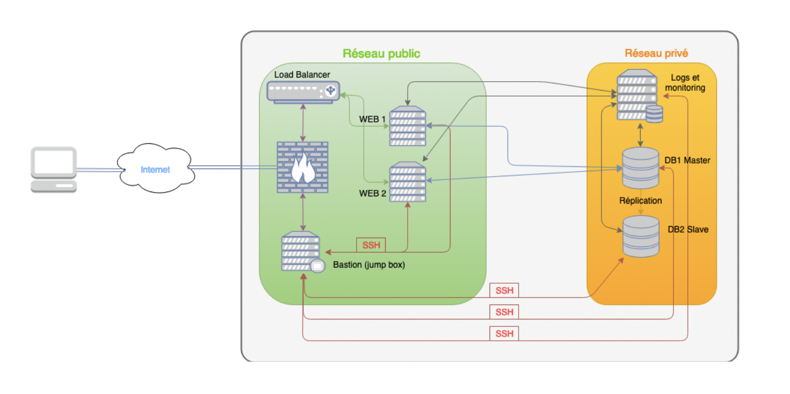

# AD10 - JBM - Sujet Labo

## SUJET DU LABORATOIRE

Ce laboratoire consiste à mettre en œuvre une architecture d'hébergement relativement complexe
reposant sur l'utilisation de serveurs Linux. 
Ce sujet nécessite l’utilisation d’un **Vagrantfile** reposant sur le
mode "**multi- machines**" de Vagrant. 
Utilisez cette fonctionnalité comme base de travail.
Le rendu attendu est le Vagrantfile complet permettant de monter l’architecture demandée ci-dessous ainsi
qu’un fichier « reponses_ad10_labo.txt ».

## Architecture d’hébergement

> Vous êtes lead developper chez BigPurePlayer.com et vous avez été chargé de la refonte globale du
portail web de support client.

> Vous avez presque terminé ce développement et êtes en phase de test.

> Votre équipe et vous avez travaillé, jusqu'à maintenant, sur un simple serveur LAMP, tout ce qu'il y a de plus classique. 

> Toutefois, conscient des problèmes de sécurité et de performance que vous avez
rencontré en production avec la version précédente du portail, vous avez décidé de passer à une
architecture d'hébergement un peu plus robuste. 

> Pour cela, vous avez fait appel à l'aide d'un de vos collègues de l'IT, qui s'y connait un peu plus que vous dans ce domaine. 

> Ce dernier vous a proposé l'architecture suivante :

<br>

<br>
<br>

Elle se compose :

- D'une passerelle/firewall
- D'un répartiteur de charge en frontal devant deux serveurs WEB placés dans un sous réseau public
- De deux serveur SGBDR répliqués placés dans un sous réseau privé
- D'un service de logs et d'un service de monitoring, placé dans le même sous réseau privé que les
SGBDR
- D'un bastion (jumpbox), placé dans le sous réseau public, et accessible en SSH depuis Internet
Spécificités :
- Seul le bastion est accessible en SSH depuis Internet. L'administration des autres machines du
réseau se fait en SSH à travers le bastion.
- L'accès SSH au bastion se fait uniquement par un système de clé privée/publique
- Le service de répartition de charge repose sur HAProxy
- Le service de logs repose sur Graylog et le service de monitoring sur Shinken
- Le SGBDR choisi est MariaDb
- Pour les besoins du labo, vous monterez un simple Wordpress fonctionnel

```diff
+ Avant de valider cette architecture et de la passer en production, vous devez vous assurer qu'elle est fonctionnelle et que vous serez capable de la mettre en œuvre.

+ Pour cela, vous devez monter cette architecture en laboratoire en utilisant votre stack habituelle, à savoir Vagrant et VirtualBox.
```


Ce labo reposant sur l'utilisation du mode "**multi-machines**" de Vagrant.

**CONSEIL** : 

```diff
+ N'oubliez pas que le nombre de machines est limité en local (par la RAM notamment). 
+ Ne pas confondre service et serveur. 
+ Le nombre de serveurs peut être différent du nombre de services.
+ Le choix de répartition des services sur les serveurs doit être judicieux, au même titre que le choix des noms de machines (noms d’hôte) qui doivent permettre de comprendre facilement le rôle de chaque machine.
```

## Vous pouvez vous appuyer sur les ressources suivantes :

- [x] -  https://litslink.com/blog/web-application-architecture
- [x] -  https://aws.amazon.com/fr/quickstart/architecture/wordpress-high-availability-bitnami/
- [x] -  https://smallstep.com/blog/diy-ssh-bastion-host/
- [x] -  https://goteleport.com/blog/ssh-bastion-host/
- [x] -  https://www.vagrantup.com/docs/multi-machine

## Questions complémentaires

- Combien de machines sont nécessaires a minima pour mettre en œuvre cette architecture ?
- À quel coût annuel estimez-vous cette architecture (matériel, infra et soft uniquement) ?
- Avez-vous des remarques ou des propositions pour améliorer cette architecture ? Si oui, lesquelles ?
- Avez-vous créé des scripts pour mettre en œuvre cette architecture ? Si oui, merci de les fournir.
- Quels aspects de cette architecture vous ont semblé les plus complexes à mettre en œuvre ?
